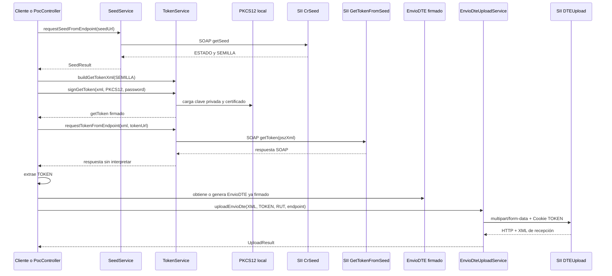

# Informe técnico: envío de un `EnvioDTE` firmado al SII

## 1. Objetivo y alcance

Este informe describe la funcionalidad existente para enviar al Servicio de
Impuestos Internos (SII) un XML `EnvioDTE` ya firmado. Incluye los pasos previos
de autenticación mediante semilla y token, las variantes de ejecución
disponibles, el contrato HTTP del upload, sus dependencias y los principales
riesgos de migración.

El análisis se basa en el código presente en este repositorio, especialmente:

- `PocController`;
- `SeedService`;
- `TokenService`;
- `EnvioDteService`;
- `EnvioDteUploadService`;
- `DteSigningService`;
- los XSD, pruebas, configuración y documentación local relacionada.

Los endpoints y reglas descritos como “implementados” reflejan este checkout.
No se realizó una consulta a documentación oficial vigente del SII ni una
prueba real contra sus ambientes; por tanto, no deben interpretarse como
confirmación de que las URLs o contratos continúen vigentes.

## 2. Resumen ejecutivo

El flujo implementado tiene tres etapas lógicas:

1. solicitar una `SEMILLA` al servicio SOAP `CrSeed`;
2. construir y firmar un XML `getToken`, enviarlo por SOAP a
   `GetTokenFromSeed` y extraer el `TOKEN`;
3. enviar el `EnvioDTE` firmado mediante `POST multipart/form-data`, usando el
   token en la cookie HTTP `TOKEN`.

El upload propiamente tal está encapsulado en:

```java
EnvioDteUploadService.uploadEnvioDte(...)
```

Este método recibe el XML ya firmado, token, partes numérica y verificadora de
los RUT, y URL de destino. Construye todo el multipart en memoria usando
ISO-8859-1, fuerza HTTP/1.1, envía la solicitud de forma síncrona y retorna un
`UploadResult` con:

- código HTTP remoto;
- `TRACKID`;
- `STATUS` o `ESTADO`;
- `RAZON`;
- cuerpo original de la respuesta.

Existen dos rutas de orquestación:

- **flujo POC por etapas:** `/poc/run` → `/poc/token` → `/poc/dte` →
  `/poc/dte-upload`, comunicadas mediante archivos bajo `output/`;
- **flujo integral:** `/poc/send-sii`, que obtiene semilla y token, genera y
  firma el DTE, valida criptográficamente las firmas y hace el upload en una
  misma petición.

El flujo no implementa persistencia de estado, reintentos, expiración/renovación
de token, consulta posterior del estado del envío ni una interpretación robusta
de éxito de negocio. Recibir un `TRACKID` es tratado como parte de la respuesta
del upload, pero el código no sigue el procesamiento posterior del documento.

## 3. Vista general del flujo



## 4. Variantes de ejecución existentes

### 4.1 Flujo POC por etapas y archivos

#### Etapa A: `GET /poc/run`

1. Usa directamente el endpoint de certificación codificado en el controlador:
   `https://maullin.sii.cl/DTEWS/CrSeed.jws`.
2. `SeedService` ejecuta la solicitud SOAP.
3. El controlador guarda `ESTADO` y `SEMILLA` en `output/seed.xml`.

Este endpoint no exige que `ESTADO` sea `"00"` antes de guardar el resultado ni
antes de responder localmente con éxito.

#### Etapa B: `GET /poc/token`

1. Lee `output/seed.xml`.
2. Extrae la primera etiqueta `SEMILLA`.
3. Lee `certificado.ruta` y `certificado.password` desde
   `src/main/resources/application-develop.properties`.
4. Construye el XML `getToken`.
5. Firma ese XML con la clave del PKCS#12.
6. Guarda una copia en `output/signed_gettoken.xml`.
7. Lo envía al endpoint codificado:
   `https://maullin.sii.cl/DTEWS/GetTokenFromSeed.jws`.
8. Intenta extraer `ESTADO` y `TOKEN` de la respuesta SOAP.
9. Guarda ambos, más la respuesta completa, en `output/token.xml`.

Los errores al interpretar la respuesta se ignoran dentro de un `catch`. Es
posible generar un `token.xml` con token vacío y aun así devolver HTTP 200 desde
el endpoint local.

#### Etapa C: `GET /poc/dte`

Genera y firma:

1. el TED/FRMT;
2. el `Documento`;
3. el `SetDTE`.

El resultado se guarda como `output/envio.xml`. Esta etapa está fuera del
upload propiamente tal, pero produce su entrada principal.

#### Etapa D: `POST /poc/dte-upload`

1. Carga siempre `application-develop.properties`.
2. Resuelve el token:
   - usa el parámetro HTTP `token`, si fue enviado y no está vacío;
   - en caso contrario lee la primera etiqueta `TOKEN` de `output/token.xml`.
3. Resuelve `rutEnvia`, `rutEmpresa` y endpoint:
   - usa parámetros HTTP si están presentes;
   - si no, usa propiedades y luego valores predeterminados codificados.
4. Separa cada RUT en parte numérica y dígito verificador.
5. Lee `output/envio.xml` como ISO-8859-1.
6. Invoca `EnvioDteUploadService.uploadEnvioDte(...)`.
7. Guarda el resultado en `output/upload_response.xml`.
8. Devuelve HTTP 200 local siempre que no se haya lanzado una excepción,
   independientemente del código HTTP o estado de negocio retornado por el SII.

Esta ruta **no valida la firma ni el XSD** del archivo antes del upload. Su
contrato práctico es “subir el contenido almacenado en `output/envio.xml`”.

### 4.2 Flujo integral: `POST /poc/send-sii`

Recibe:

- `env`, con valor predeterminado `CERT`;
- `rutEnvia`, opcional.

La selección implementada es:

| Valor | Semilla | Token | Upload |
|---|---|---|---|
| `PROD` | `https://palena.sii.cl/DTEWS/CrSeed.jws` | `https://palena.sii.cl/DTEWS/GetTokenFromSeed.jws` | `https://palena.sii.cl/cgi_dte/UPL/DTEUpload` |
| cualquier otro valor | `https://maullin.sii.cl/DTEWS/CrSeed.jws` | `https://maullin.sii.cl/DTEWS/GetTokenFromSeed.jws` | `https://maullin.sii.cl/cgi_dte/UPL/DTEUpload` |

El flujo ejecuta:

1. lectura del PKCS#12 y RUT desde `application-develop.properties`;
2. obtención de semilla;
3. construcción y firma del `getToken`;
4. solicitud y extracción del token;
5. generación y firma del DTE y del `SetDTE`;
6. persistencia de una copia en `output/envio.xml`;
7. validación criptográfica de todas las firmas XMLDSig encontradas;
8. upload multipart;
9. respuesta local con código HTTP remoto, `TrackID` y estado.

El método sólo comprueba que la semilla y el token no sean nulos. No exige
`ESTADO == "00"` y acepta un token compuesto sólo por espacios, porque la
extracción aplica `trim()` pero la condición posterior sólo comprueba `null`.

La validación de firmas usa los certificados incluidos en el mismo XML. Esto
comprueba integridad criptográfica, pero no cadena de confianza, vigencia,
revocación ni autorización del firmante.

## 5. Obtención de semilla

### 5.1 Contrato interno

```java
SeedResult requestSeedFromEndpoint(String endpointUrl) throws Exception
```

`SeedResult` contiene:

```text
estado
semilla
```

### 5.2 Solicitud SOAP implementada

```http
POST [endpointUrl]
Content-Type: text/xml; charset=ISO-8859-1
SOAPAction: "getSeed"
```

```xml
<?xml version="1.0" encoding="ISO-8859-1"?>
<soapenv:Envelope
    xmlns:soapenv="http://schemas.xmlsoap.org/soap/envelope/">
  <soapenv:Header/>
  <soapenv:Body>
    <getSeed xmlns="http://DefaultNamespace"/>
  </soapenv:Body>
</soapenv:Envelope>
```

Se utiliza `java.net.http.HttpClient` con envío síncrono. La respuesta se lee
como bytes y se decodifica con ISO-8859-1.

### 5.3 Interpretación de la respuesta

`SeedService.parseSeedResponse(...)` soporta dos formas:

- `ESTADO` y `SEMILLA` directamente en el SOAP/XML;
- XML interno dentro de `getSeedReturn`, escapado como texto.

Para la segunda forma realiza un unescape manual y vuelve a parsear el contenido.

Sólo esta llamada de las tres interacciones externas rechaza explícitamente
códigos HTTP no 2xx. Aun así, no valida que el estado de negocio sea `"00"`.

## 6. Obtención del token

### 6.1 Construcción de `getToken`

`TokenService.buildGetTokenXml(semilla)` produce:

```xml
<?xml version="1.0" encoding="ISO-8859-1"?>
<getToken>
  <item>
    <Semilla>[SEMILLA]</Semilla>
  </item>
</getToken>
```

El valor se escapa para `&`, `<` y `>`.

### 6.2 Firma de `getToken`

`TokenService.signGetToken(...)`:

1. configura propiedades globales del proceso para evitar saltos CRLF en
   bloques Base64;
2. carga el primer alias de un PKCS#12;
3. obtiene clave privada y certificado X.509;
4. parsea el XML con DOM y namespaces;
5. crea una firma XMLDSig enveloped sobre el documento completo:
   - `Reference URI=""`;
   - transform `enveloped-signature`;
   - digest SHA-1;
   - canonicalización C14N inclusiva;
   - firma RSA-SHA1;
6. incorpora `X509Data/X509Certificate`;
7. inserta `Signature` dentro de `getToken`;
8. comprueba forma mínima del XML;
9. serializa como ISO-8859-1;
10. normaliza el certificado Base64 a una sola línea;
11. rechaza entidades o caracteres CR en valores de firma/digest.

La carga del certificado es parte de `TokenService`, no de una abstracción de
credenciales compartida.

### 6.3 Solicitud `GetTokenFromSeed`

El XML firmado se escapa y se inserta como texto en `pszXml`:

```http
POST [tokenUrl]
Content-Type: text/xml; charset=ISO-8859-1
SOAPAction: "getToken"
```

```xml
<?xml version="1.0" encoding="ISO-8859-1"?>
<soapenv:Envelope
    xmlns:soapenv="http://schemas.xmlsoap.org/soap/envelope/">
  <soapenv:Header/>
  <soapenv:Body>
    <getToken xmlns="http://DefaultNamespace">
      <pszXml
          xsi:type="xsd:string"
          xmlns:xsi="http://www.w3.org/2001/XMLSchema-instance"
          xmlns:xsd="http://www.w3.org/2001/XMLSchema">
        [getToken firmado y escapado]
      </pszXml>
    </getToken>
  </soapenv:Body>
</soapenv:Envelope>
```

`requestTokenFromEndpoint(...)` devuelve el cuerpo remoto sin interpretar y no
comprueba el código HTTP.

### 6.4 Extracción del token

La extracción no pertenece a `TokenService`; está duplicada en
`PocController`:

- `/poc/token` obtiene `ESTADO` y `TOKEN`, pero silencia errores;
- `/poc/send-sii` usa `extractTokenFromResponse(...)`, obtiene sólo `TOKEN`,
  registra el error y devuelve `null`.

Ambas variantes buscan `getTokenReturn`, leen su texto como XML interno y
extraen la primera etiqueta `TOKEN`.

El token se usa directamente como:

```http
Cookie: TOKEN=[token]
```

No se conoce ni controla en el código:

- fecha de emisión o expiración;
- reutilización permitida;
- vínculo explícito con ambiente;
- vínculo explícito con RUT o certificado;
- invalidación;
- renovación;
- protección en reposo.

En el flujo integral, el mismo archivo PKCS#12 se usa para firmar la solicitud
de token y los XML del envío, pero esta coherencia es accidental al orquestador,
no una regla comprobada por `EnvioDteUploadService`.

## 7. Entrada del upload

### 7.1 Contrato del servicio

```java
UploadResult uploadEnvioDte(
    String envioDteXml,
    String token,
    String rutSender,
    String dvSender,
    String rutCompany,
    String dvCompany,
    String endpointUrl
) throws Exception
```

| Parámetro | Uso | Precondición efectiva |
|---|---|---|
| `envioDteXml` | Contenido del archivo multipart `archivo` | Debe estar completo y firmado antes de entrar. El servicio no valida estructura, firmas ni encoding declarado. |
| `token` | Valor de cookie `TOKEN` | Debe ser válido para el ambiente; no se valida nulo, vacío ni caracteres de control. |
| `rutSender` | Campo multipart `rutSender` | Parte numérica del RUT que envía. |
| `dvSender` | Campo multipart `dvSender` | Dígito verificador del RUT que envía. |
| `rutCompany` | Campo multipart `rutCompany` | Parte numérica del RUT de la empresa emisora. |
| `dvCompany` | Campo multipart `dvCompany` | Dígito verificador del RUT emisor. |
| `endpointUrl` | Destino HTTP | Debe ser una URI aceptada por `HttpRequest`; el servicio no restringe host, esquema ni ambiente. |

El controlador interpreta:

```text
RutEnvia  -> rutSender + dvSender
RutEmisor -> rutCompany + dvCompany
```

Sin embargo, toma los RUT desde parámetros/configuración y no comprueba que
coincidan con `Caratula/RutEnvia` y `Caratula/RutEmisor` dentro del XML.

`splitRut(...)` elimina puntos, separa por el último guion y valida únicamente
la forma. No calcula ni comprueba el dígito verificador.

## 8. Construcción de la solicitud de upload

### 8.1 Cuerpo multipart

Se genera un boundary aleatorio con `UUID.randomUUID()` y se construye el cuerpo
completo en un `ByteArrayOutputStream`.

Forma lógica:

```http
--[boundary]
Content-Disposition: form-data; name="rutSender"

[RUT numérico que envía]
--[boundary]
Content-Disposition: form-data; name="dvSender"

[DV que envía]
--[boundary]
Content-Disposition: form-data; name="rutCompany"

[RUT numérico emisor]
--[boundary]
Content-Disposition: form-data; name="dvCompany"

[DV emisor]
--[boundary]
Content-Disposition: form-data; name="archivo"; filename="envio.xml"
Content-Type: text/xml

[EnvioDTE firmado]
--[boundary]--
```

Los separadores multipart usan CRLF y todos los campos, incluido el archivo, se
codifican como ISO-8859-1.

### 8.2 Cabeceras HTTP

```http
POST [endpointUrl]
User-Agent: Mozilla/4.0 (compatible; PROG 1.0; Windows NT 5.0; YComp 5.0.2.4)
Cookie: TOKEN=[token]
Content-Type: multipart/form-data; boundary=[UUID]
```

El cliente:

- usa `java.net.http.HttpClient`;
- fuerza HTTP/1.1;
- realiza una llamada bloqueante;
- no define timeout de conexión ni de solicitud;
- no configura reintentos;
- no configura proxy;
- no aporta certificado TLS de cliente;
- no administra cookies mediante `CookieManager`;
- no agrega `Accept`, `Content-Length` manual ni
  `Content-Transfer-Encoding`.

La autenticación del upload se limita al token enviado por cookie.

## 9. Respuesta del upload

### 9.1 Contrato interno

```java
class UploadResult {
    int statusCode;
    String trackId;
    String estado;
    String razon;
    String rawResponse;
}
```

La respuesta remota se decodifica como ISO-8859-1. Luego se intenta parsear como
XML y extraer:

- `TRACKID`;
- primero `STATUS` y, si no existe, `ESTADO`;
- `RAZON`.

La búsqueda acepta cualquier namespace o ausencia de namespace. Si el parseo
falla, se registra una advertencia y los campos derivados quedan nulos; el
`UploadResult` igualmente se devuelve.

### 9.2 Semántica de éxito realmente implementada

`EnvioDteUploadService` no define una regla de éxito. Retorna cualquier código
HTTP y cualquier cuerpo.

Los controladores tampoco traducen el resultado remoto:

- `/poc/dte-upload` devuelve HTTP 200 local si el transporte no lanzó una
  excepción;
- `/poc/send-sii` también devuelve HTTP 200 local y muestra el código remoto
  dentro del texto.

No se exige:

- código HTTP 2xx;
- presencia de `TRACKID`;
- valor específico de `STATUS/ESTADO`;
- ausencia de `RAZON`;
- correlación con el XML enviado.

Por ello, “la llamada terminó” no equivale a “el SII aceptó el DTE”.
Además, el código no implementa una consulta posterior usando el `TRACKID`; el
alcance termina en la recepción inicial del upload.

## 10. Reglas de negocio observadas

### 10.1 Reglas explícitas

- Antes del flujo integral se debe obtener una semilla.
- La semilla se incorpora a un `getToken` firmado.
- El token se envía al upload como cookie `TOKEN`.
- El upload usa cuatro componentes de RUT separados:
  `rutSender`, `dvSender`, `rutCompany`, `dvCompany`.
- El XML se envía en el campo multipart `archivo`, con filename fijo
  `envio.xml` y tipo `text/xml`.
- La codificación usada por el flujo es ISO-8859-1.
- El flujo integral intenta validar las firmas antes de subir.
- Certificación y producción utilizan tríos distintos de URLs.

### 10.2 Reglas implícitas o no comprobadas

- `rutSender/dvSender` deberían representar a `Caratula/RutEnvia`.
- `rutCompany/dvCompany` deberían representar a `Caratula/RutEmisor`.
- El token debería pertenecer al mismo ambiente al que se realiza el upload.
- El token y los RUT deberían corresponder a una identidad autorizada.
- El XML debería tener firma válida de `Documento` y `SetDTE`.
- El XML debería validar contra `EnvioDTE_v10.xsd`.
- El documento debería respetar cantidad, tipos y subtotales declarados en la
  carátula.
- El token debería obtenerse sólo si `ESTADO == "00"`.
- El upload debería considerarse exitoso sólo según una política explícita que
  combine HTTP y respuesta SII.

Ninguna de esas correspondencias se valida dentro de
`EnvioDteUploadService`.

## 11. Dependencias internas

| Componente | Responsabilidad en el flujo |
|---|---|
| `PocController` | Orquestación, selección de ambiente, lectura/escritura de archivos, resolución de configuración, separación de RUT, extracción de token y traducción a respuestas HTTP locales. |
| `SeedService` | Construcción del SOAP `getSeed`, llamada a `CrSeed` y extracción de `ESTADO/SEMILLA`. |
| `TokenService` | Construcción y firma del `getToken`; llamada SOAP a `GetTokenFromSeed`. |
| `DteService` | Generación del `Documento`, TED/FRMT y firma del documento en el flujo integral. |
| `EnvioDteService` | Construcción de `EnvioDTE/SetDTE`, firma del `SetDTE` y utilidad no usada de extracción de RUT. |
| `DteSigningService` | Validación criptográfica de todas las firmas XMLDSig antes del upload integral. |
| `EnvioDteUploadService` | Construcción multipart, envío HTTP y parseo básico de respuesta. |
| XSD locales | Definen estructura de DTE, `EnvioDTE` y XMLDSig; no son ejecutados por el servicio de upload. |
| `logback-spring.xml` | Logs separados de operaciones SII y upload bajo `output/` por defecto. |

Los servicios se instancian mayoritariamente con `new` dentro del controlador.
Sólo `DteSigningService` se inyecta como bean Spring. Por ello, las dependencias
de red, reloj, archivos y credenciales no son sustituibles fácilmente en
pruebas.

`EnvioDteService` declara un campo `DteService`, pero no lo utiliza en los
métodos inspeccionados.

## 12. Dependencias externas

### 12.1 Servicios del SII

- SOAP `CrSeed`;
- SOAP `GetTokenFromSeed`;
- CGI/HTTP `DTEUpload`.

La disponibilidad del flujo depende de DNS, conectividad, TLS, compatibilidad
SOAP, contratos XML, vigencia de endpoints y políticas del SII.

### 12.2 Credenciales y PKI

- archivo PKCS#12;
- contraseña del PKCS#12;
- certificado X.509;
- clave privada RSA;
- certificado autorizado para solicitar token y firmar documentos;
- CAF/clave para TED, si el XML se genera en el mismo proceso.

El upload no usa directamente el PKCS#12, pero depende del token y del XML
producidos con esas credenciales.

### 12.3 Plataforma Java

- Java 21;
- `java.net.http.HttpClient`;
- W3C DOM y parsers JAXP;
- JCA/KeyStore/X.509;
- JSR 105 XML Digital Signature;
- `ByteArrayOutputStream`;
- charsets UTF-8 e ISO-8859-1;
- SLF4J/Logback.

No hay un cliente SOAP ni una biblioteca multipart externa. Los sobres SOAP,
escapes XML y multipart se construyen manualmente.

### 12.4 Framework

- Spring Boot 3.5.10;
- Spring Web para exponer los endpoints POC;
- configuración por `Properties` leída manualmente, no por
  `@ConfigurationProperties`.

## 13. Infraestructura y configuración

### 13.1 Propiedades observadas

El archivo local ignorado por Git contiene, entre otras:

```properties
certificado.ruta=...
certificado.password=...
caf.ruta=...
caf.tipodocumento=...
sii.ambiente=...
xsd.ruta=...
sii.upload.endpoint=...
sii.upload.rutEnvia=...
sii.upload.rutEmpresa=...
logging.file.name=...
```

El controlador abre directamente:

```text
src/main/resources/application-develop.properties
```

Esto depende del directorio de trabajo y de que el archivo exista físicamente
en el árbol de fuentes. Incluso `/poc/dte-upload`, que podría recibir todos sus
parámetros, intenta abrir el archivo antes de usarlos.

La resolución de ambiente no está centralizada:

- `sii.ambiente` existe en el archivo, pero el flujo inspeccionado no lo usa;
- `sii.upload.endpoint` se usa como fallback en `/poc/dte-upload`;
- `/poc/send-sii` ignora ambas propiedades y selecciona URLs codificadas según
  su parámetro `env`;
- `/poc/run` y `/poc/token` siempre apuntan a Maullín.

### 13.2 Archivos transitorios

El flujo por etapas depende de:

```text
output/seed.xml
output/signed_gettoken.xml
output/token.xml
output/envio.xml
output/upload_response.xml
```

`output/` y `application-develop.properties` están ignorados por Git. No existe
persistencia transaccional, bloqueo de archivos, aislamiento por usuario o
correlación de ejecuciones. Dos solicitudes concurrentes pueden leer o
sobrescribir los mismos artefactos.

### 13.3 Logging

Logback escribe por defecto:

```text
output/sii-operations.log
output/dte-upload.log
```

El paquete del proyecto y el controlador están configurados en DEBUG. El flujo
integral registra:

- la semilla en INFO;
- el token en INFO;
- el XML firmado completo en DEBUG;
- RUT y endpoint.

Esto expone material sensible y documentos tributarios en logs. La rotación
local es de siete días, pero no existe en el código una política de acceso,
cifrado o borrado seguro.

## 14. Clasificación para migración

### 14.1 Lógica de negocio reutilizable

Puede extraerse conceptualmente:

- orquestación por etapas: semilla → token → upload;
- política que impide el upload sin autenticación vigente;
- modelado de `SeedResult`, `TokenResult` y `UploadResult`;
- separación semántica entre RUT del firmante/enviante y RUT de la empresa;
- construcción del multipart con los campos exigidos por el protocolo;
- envío del token como cookie cuando el contrato externo lo requiera;
- parseo tolerante de una respuesta con `TRACKID`, estado y razón;
- validación previa del sobre firmado;
- correlación del `TRACKID` con el envío y seguimiento posterior;
- tratamiento de códigos HTTP y estados de negocio como dimensiones separadas.

Para que sea realmente reutilizable, esta lógica debe depender de interfaces de
cliente SII, proveedor de credenciales, reloj, almacenamiento y políticas, no de
archivos/rutas concretas.

### 14.2 Código específico de este proyecto

- endpoints `/poc/run`, `/poc/token`, `/poc/dte`,
  `/poc/dte-upload` y `/poc/send-sii`;
- uso de `PocController` como orquestador monolítico;
- archivos bajo `output/` como mecanismo de integración;
- valores de RUT, receptor, tipo 33 y folio codificados;
- ID `SIIPROXY_SetDoc`;
- nombre fijo `envio.xml`;
- rutas de propiedades dentro de `src/main/resources`;
- instanciación manual de servicios;
- respuestas de texto de los endpoints;
- estructura `UploadResponse` creada sólo para diagnóstico;
- configuración Logback y nombres de archivos;
- fallback de cualquier ambiente desconocido a certificación;
- utilidades privadas `splitRut`, `escapeXml` y
  `extractTokenFromResponse`.

### 14.3 Infraestructura o configuración

- URLs por ambiente;
- certificados, claves, CAF y contraseñas;
- truststore TLS y autoridades certificadoras;
- conectividad saliente, DNS, firewall y proxy;
- timeouts, reintentos, circuit breaker y límites de concurrencia;
- almacenamiento seguro de token y XML;
- política de logs y datos tributarios;
- validación XSD;
- reloj sincronizado;
- observabilidad y trazabilidad;
- gestión de secretos;
- persistencia de `TRACKID` y estado;
- despliegue con Java/proveedor criptográfico compatible.

### 14.4 Elementos que no deberían copiarse literalmente

1. **URLs codificadas en el controlador.** Deben externalizarse por ambiente y
   verificarse contra documentación oficial vigente.
2. **Aceptar cualquier `env` distinto de `PROD` como certificación.** Conviene
   usar un enum cerrado y rechazar valores desconocidos.
3. **Leer secretos desde el árbol de fuentes.** Debe utilizarse un proveedor de
   secretos/configuración, con permisos y rotación.
4. **Guardar token y respuestas completas en XML local.** El token es una
   credencial; requiere protección, expiración y acceso restringido.
5. **Registrar semilla, token y XML completo.** Deben aplicarse redacción,
   clasificación de datos y logging mínimo.
6. **Recibir el endpoint como parámetro HTTP sin lista permitida.** Si el
   endpoint local es accesible, esto habilita un riesgo de SSRF y envío de token
   a un host arbitrario.
7. **Construir SOAP mediante concatenación y escapes manuales.** Conviene usar
   serialización XML segura o un cliente tipado, evitando doble escape y
   documentos mal formados.
8. **Usar parsers DOM sin endurecimiento.** Deben deshabilitarse DTD y entidades
   externas y aplicarse límites de tamaño para evitar XXE y agotamiento de
   recursos.
9. **Omitir timeout y retry policy.** Las llamadas síncronas pueden bloquear
   indefinidamente o fallar sin una estrategia segura.
10. **Reintentar upload sin idempotencia definida.** Aunque hoy no hay reintento,
    una migración no debe agregarlo ciegamente: debe evitar duplicar envíos y
    correlacionar resultados ambiguos.
11. **No comprobar HTTP en token/upload.** Deben distinguirse fallos de
    transporte, protocolo, autenticación y negocio.
12. **No exigir `ESTADO == "00"` para semilla/token.** La secuencia debe detenerse
    ante una respuesta de negocio inválida.
13. **Aceptar token vacío.** Deben validarse presencia, formato permitido,
    ambiente y vigencia cuando sea posible.
14. **Inyectar el token directamente en `Cookie`.** Deben rechazarse caracteres
    de control y usarse una abstracción de cookies/cabeceras segura.
15. **No validar coherencia entre multipart y carátula.** RUT de parámetros,
    token, certificado y XML deben corresponder al mismo contexto autorizado.
16. **Validar firma usando sólo el certificado embebido.** Eso prueba integridad,
    no confianza o autorización.
17. **No validar XSD antes de subir.** La validez estructural y la criptográfica
    deben comprobarse por separado.
18. **Construir todo el multipart en memoria.** Para sobres grandes debe usarse
    streaming y límites explícitos.
19. **Usar `String.length()` como cantidad de bytes.** No es una medida correcta
    del payload codificado; debe medirse el arreglo de bytes.
20. **User-Agent legado codificado.** Debe confirmarse si el protocolo realmente
    lo requiere y centralizarse como configuración.
21. **Devolver HTTP 200 local ante rechazo remoto.** Debe mapearse el resultado a
    un contrato API coherente sin perder la respuesta del SII.
22. **Silenciar errores de parseo.** Debe conservarse el cuerpo para diagnóstico,
    pero marcar el resultado como no interpretable.
23. **Insertar `rawResponse` dentro de CDATA sin tratar `]]>`.** Una respuesta con
    ese texto genera un `upload_response.xml` mal formado.
24. **Usar archivos compartidos como estado entre endpoints.** No es seguro con
    concurrencia, múltiples usuarios o varias instancias.
25. **Duplicar extracción de token.** Debe existir un único parser probado de la
    respuesta `GetTokenFromSeed`.
26. **Seleccionar el primer alias del PKCS#12.** Debe seleccionarse explícitamente
    el certificado correcto y validarse su vigencia/uso.
27. **Cambiar propiedades globales de XML security durante cada firma.** Es un
    efecto global del proceso y debe centralizarse o evitarse.
28. **Copiar SHA-1/RSA-SHA1 fuera del perfil legado exigido por el SII.** No deben
    convertirse en algoritmos generales de la plataforma.

## 15. Hallazgos y brechas

| Prioridad | Hallazgo | Impacto |
|---|---|---|
| Alta | El token y el XML firmado completo se registran en logs. | Exposición de credenciales y datos tributarios. |
| Alta | `endpoint` puede llegar como parámetro sin restricción de host. | Posible SSRF y exfiltración del token/XML. |
| Alta | No se valida `ESTADO == "00"` al obtener semilla/token. | El flujo puede continuar con autenticación rechazada o incompleta. |
| Alta | `/poc/dte-upload` no valida firma, XSD ni coherencia de RUT. | Puede enviar un sobre inválido o asociado a datos distintos. |
| Alta | La validación integral confía en certificados embebidos. | No prueba identidad, confianza ni autorización del firmante. |
| Alta | Código HTTP/estado SII no se traducen a éxito o error local. | Un rechazo remoto puede presentarse como HTTP 200. |
| Media | No hay timeouts, reintentos controlados ni idempotencia. | Bloqueo de hilos y recuperación ambigua ante fallos de red. |
| Media | Estado intermedio compartido en `output/`. | Carreras, mezcla de tokens/XML y falta de aislamiento. |
| Media | Parsers XML no endurecidos. | Riesgo XXE o agotamiento si se procesan entradas no confiables. |
| Media | Multipart completo en memoria. | Consumo elevado para sobres grandes. |
| Media | No existe seguimiento posterior por `TRACKID`. | El sistema conoce recepción inicial, no aceptación final. |
| Media | TokenService no comprueba HTTP de GetTokenFromSeed. | Respuestas de error pueden intentar parsearse como éxito. |
| Baja | El log de tamaño usa caracteres y los denomina bytes. | Métricas inexactas. |

## 16. Inconsistencias observadas

### 16.1 Utilidad de campos de upload

`EnvioDteService.buildUploadFieldsFromEnvio(...)` retorna actualmente:

```text
rutEmisor
rutEnvia
```

La única prueba de esa función espera:

```text
rutSender
dvSender
rutCompany
dvCompany
```

Además, el método no separa dígitos verificadores y no es utilizado por el
controlador. Por lo tanto, no debe tomarse como contrato reutilizable ni como
evidencia de que los campos multipart se derivan del XML.

### 16.2 Documentación frente a implementación

El README describe un flujo de referencia y afirma restricciones estrictas,
pero contiene estructura de paquetes, rutas, endpoint y configuración que no
coinciden completamente con el código actual. Debe considerarse orientación de
POC, no especificación ejecutable. Por ejemplo, el README exige bloques Base64
de hasta 76 caracteres por línea, mientras `TokenService` elimina whitespace
del certificado y lo deja en una sola línea.

### 16.3 Cobertura de pruebas

Hay pruebas para:

- parseo básico de semilla;
- llamada real a semilla en certificación;
- forma y firma de `getToken`;
- componentes de firma DTE.

No hay pruebas directas de:

- `EnvioDteUploadService`;
- construcción exacta del multipart;
- cookie `TOKEN`;
- parseo de respuestas de upload;
- errores HTTP;
- flujo `/poc/send-sii`;
- flujo `/poc/dte-upload`;
- coherencia entre RUT de carátula y campos multipart.

La prueba `EnvioDteServiceTest` depende de un archivo bajo `local-secrets/` y,
por la inconsistencia anterior, sus expectativas no coinciden con la
implementación inspeccionada.

## 17. Propuesta de separación para una migración

Sin cambiar el protocolo externo, la capacidad puede dividirse en:

1. **Cliente de autenticación SII**
   - solicita y valida semilla;
   - firma `getToken`;
   - solicita, interpreta y protege el token;
   - conoce ambiente y expiración.
2. **Validador de sobre**
   - valida XSD;
   - valida cardinalidad y ubicación de firmas;
   - verifica confianza/autorización;
   - comprueba carátula, RUT y subtotales.
3. **Cliente de upload**
   - recibe un objeto `SignedEnvioDte`;
   - construye multipart por streaming;
   - usa destinos permitidos;
   - aplica timeouts;
   - separa respuesta HTTP de resultado SII.
4. **Orquestador**
   - mantiene una máquina de estados;
   - correlaciona semilla, token, envío y `TRACKID`;
   - evita duplicados;
   - persiste auditoría sin secretos.
5. **Cliente de seguimiento**
   - consulta el procesamiento posterior usando `TRACKID`;
   - traduce estados SII a estados de dominio.
6. **Infraestructura**
   - proveedor de certificados/secretos;
   - configuración tipada por ambiente;
   - almacenamiento cifrado;
   - logging redactado;
   - métricas y alertas.

Una interfaz de upload migrable debería recibir los RUT ya validados, un
endpoint resuelto internamente por ambiente y un token encapsulado, no strings
arbitrarios provenientes directamente de una petición HTTP.

## 18. Precondiciones recomendadas antes del upload

La implementación migrada debería bloquear el envío salvo que se cumpla todo:

1. ambiente reconocido y URLs obtenidas desde configuración confiable;
2. semilla obtenida con HTTP exitoso y `ESTADO == "00"`;
3. token no vacío, obtenido para el mismo ambiente y contexto;
4. XML codificable sin pérdida en ISO-8859-1;
5. XML válido contra `EnvioDTE_v10.xsd`;
6. firma de cada `Documento` válida y ubicada correctamente;
7. firma de `SetDTE` válida y ubicada correctamente;
8. certificado confiable, vigente y autorizado;
9. `RutEnvia` coherente con `rutSender/dvSender`;
10. `RutEmisor` coherente con `rutCompany/dvCompany`;
11. RUT con dígito verificador válido;
12. carátula y subtotales coherentes con los DTE incluidos;
13. tamaño dentro de límites configurados;
14. identificador de correlación y política anti-duplicados creada;
15. logs configurados para no exponer token, certificado ni XML completo.

## 19. Verificación realizada

Se inspeccionaron código, referencias, XSD, pruebas, configuración local con
valores sensibles redactados, documentación Postman/README y logging.

Se verificó el estado de Git antes de crear este documento. Ya existían cambios
no relacionados en `DteService.java`, `DteXmlBuilder.java` y el directorio
`docs/`; no fueron modificados como parte de este análisis.

No se ejecutaron:

- solicitudes al SII;
- firma real;
- upload real;
- pruebas de integración;
- aceptación posterior por `TRACKID`.

Las afirmaciones sobre comportamiento externo se limitan a lo que construye y
procesa el código. El informe no confirma vigencia del protocolo ni aceptación
real por el SII.
